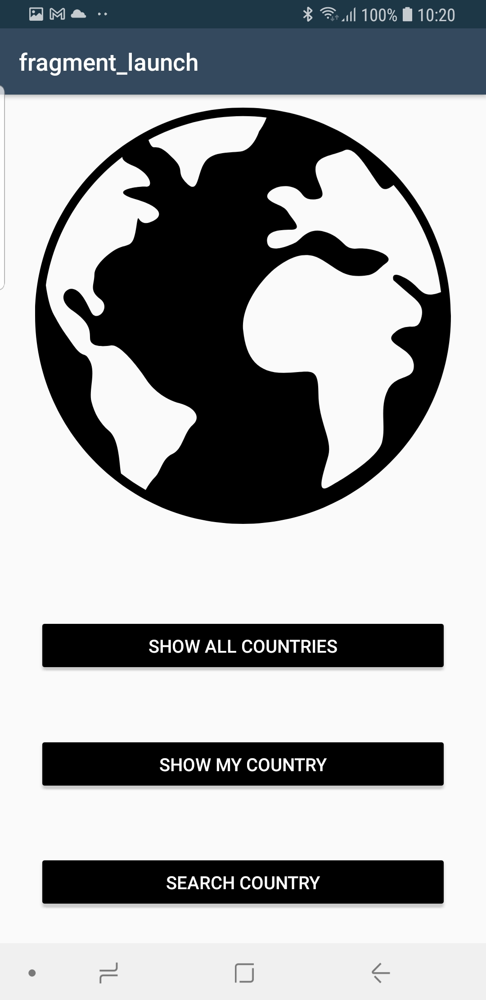
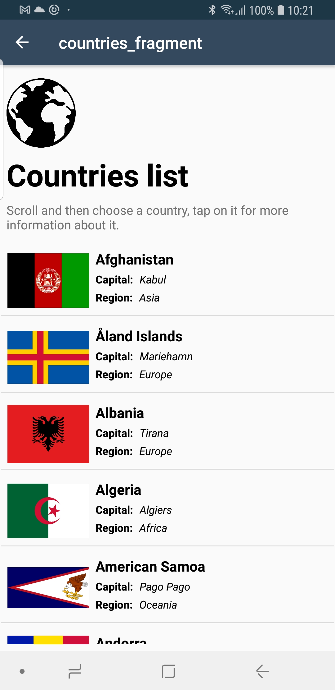
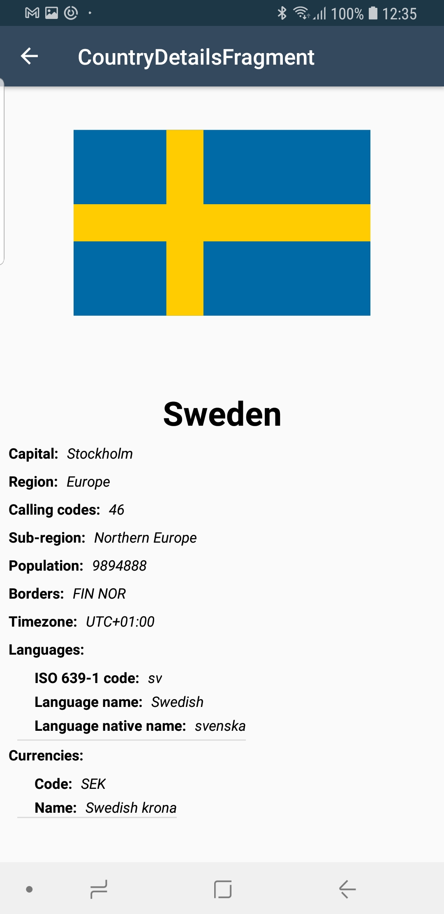
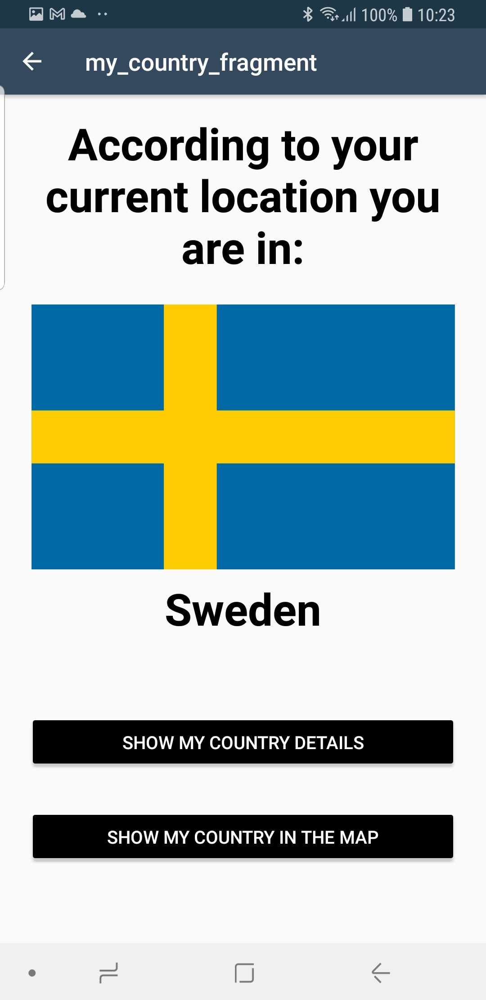
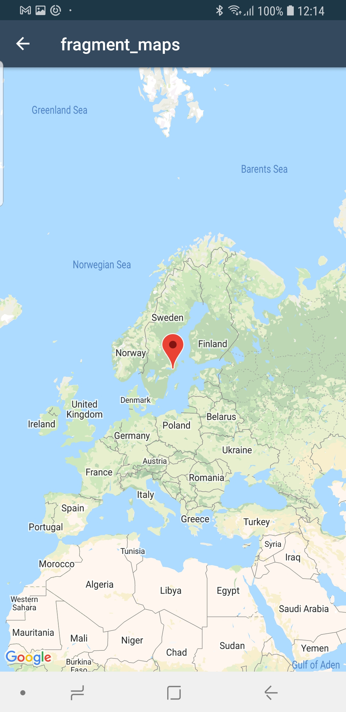
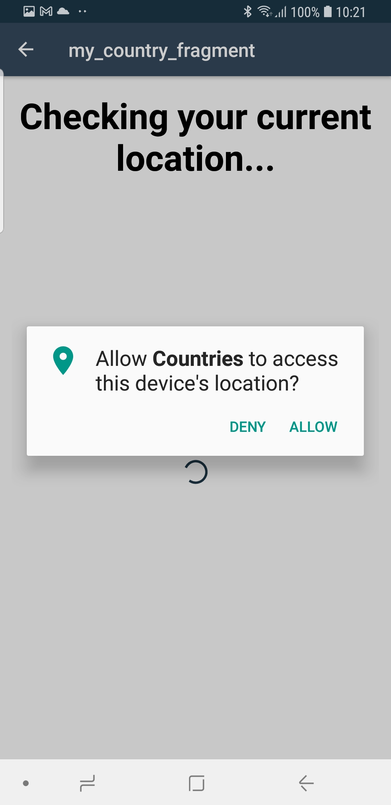
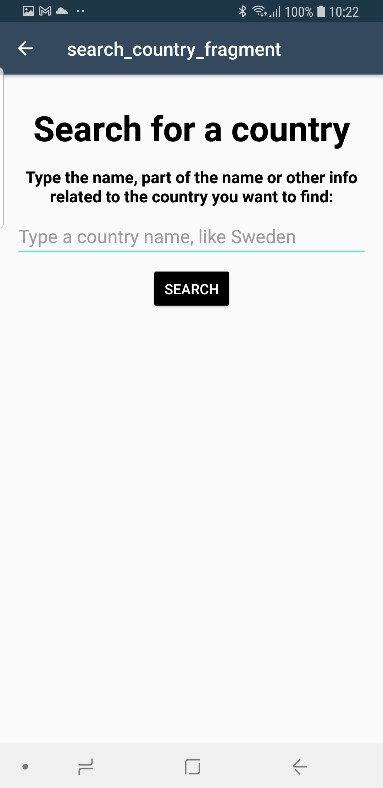
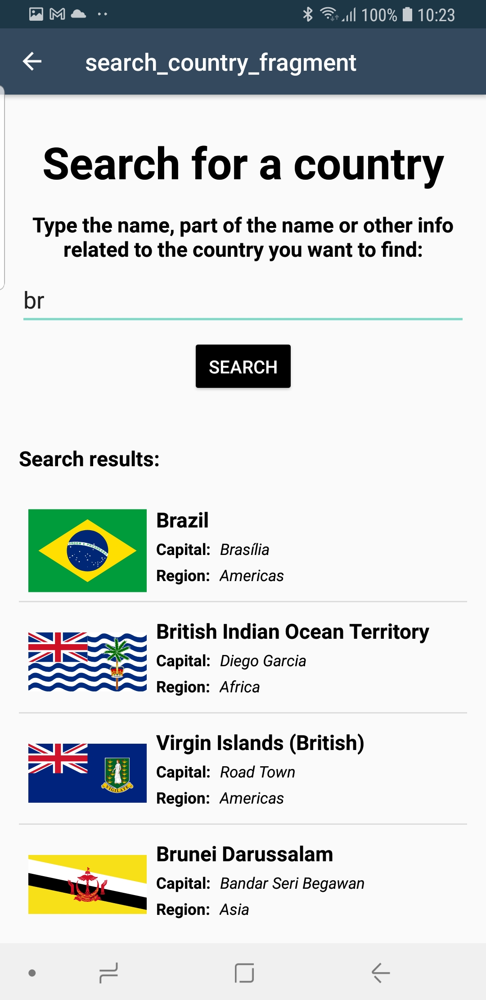
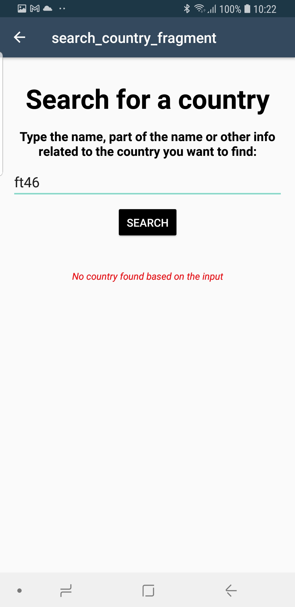

# Countries app

This is my capstone project for the Udacity Android Kotlin Developer Nanodegree Program.

## About the app

The app idea is fetch data from the countries and diplay it to the user.
There is a list of the the countries, search, show the country in the map, 
getting more details for the country and pick the country based on the 
user's current location..

## Rest API

The app is retrieving data from:

* [REST Countries] (https://restcountries.eu)

## Android components and resources

This app demonstrates the following views and techniques:

* [Retrofit](https://square.github.io/retrofit/) to make api calls to an HTTP web service.
* [Moshi](https://github.com/square/moshi) which handles the deserialization of the returned JSON to Kotlin data objects. 
* [GlideToVectorYou](https://github.com/corouteam/GlideToVectorYou) to load and cache SVG images fetched in the requests.
* [Room](https://developer.android.com/training/data-storage/room) for local database storage.
* [OkHttp](https://square.github.io/okhttp/) to help in the web requests.
* [Service Locator](https://en.wikipedia.org/wiki/Service_locator_pattern) to get the repository in a easey way.
  
It leverages the following components from the Jetpack library:

* [ViewModel](https://developer.android.com/topic/libraries/architecture/viewmodel)
* [LiveData](https://developer.android.com/topic/libraries/architecture/livedata)
* [Recycler View](https://developer.android.com/jetpack/androidx/releases/recyclerview) to display the items.
* [Data Binding](https://developer.android.com/topic/libraries/data-binding/) with binding adapters
* [Navigation](https://developer.android.com/topic/libraries/architecture/navigation/) with the SafeArgs plugin for parameter passing between fragments.

## Suggested Workflow

* Import the project in the Android Studio and run it, in a device or in the emulator.
* For the Udacity review I will leave my google API key, but will remove it later ;)

## Development helping resources and credits

For this project I did some research to help me finding solutions to some problems. I can quite a few:
* ExpressoIdlingResource.kt - got this code from the previous projects available in Udacity.
* Outcome.kt - Sealed class to help me handling the requests and exceptions, got the concept from [here](https://phauer.com/2019/sealed-classes-exceptions-kotlin/)

## Report Issues
Notice any issues with a repository? Please file a github issue in the repository.

## Screenshots

